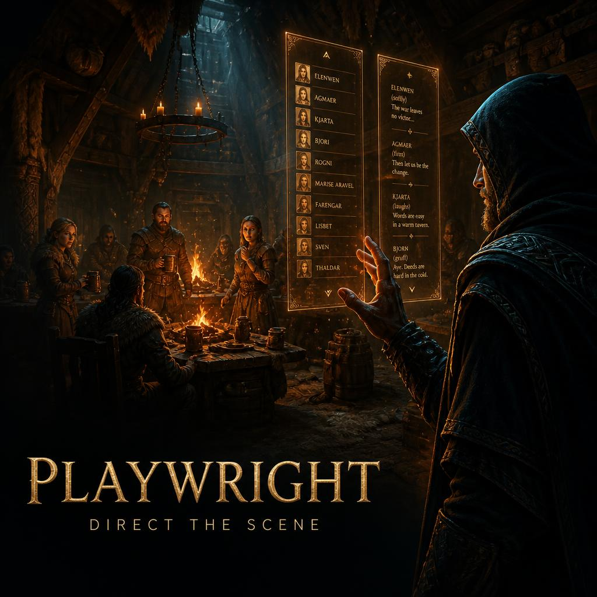

# Playwright — v0.12.1-rc1

A scene-control / NPC-puppeteering toolkit for **SkyrimNet**. Direct who's "in" a
scene, narrate it, and put words (and thoughts, and sleep) into your cast — like a
playwright running a live table read.

> Formerly "SkyrimNet Director Mode" (the `SND_` prefix). Renamed to Playwright
> (`PW_` prefix, plugin `SNPlaywright.esp`) once it grew past the original
> leave-the-scene feature.

The **PrismaUI control panel** (`SNPlaywright.dll`) is the control surface: an
on-screen, fully keyboard- and mouse-drivable panel with a live nearby-NPC list, the
full action set as buttons, a roomy text box, and an editable conversation log — no
crosshair aiming, multi-word names just work.

> **v0.7** retires the old UIExtensions radial wheel and the per-action hotkeys; the
> panel (and its keyboard controls) is now the sole interface, and **UIExtensions is no
> longer a dependency**.

> **v0.9** adds a **⚙ Settings** window (header button): a **text-size** control
> (A−/A+/Reset, scales the panel's fonts only) and a **background-opacity** slider that
> fades the panel and the conversation log together. Both persist across sessions.

> **v0.10** adds a per-NPC **action launcher**: each actor's ⋯ menu gains an
> **Actions…** entry that opens a window listing SkyrimNet's registered actions, each
> with a parameter form (actor-picker dropdowns where they apply) to fire it at that
> actor — open several at once, they stay until closed. **Narrate** is also more
> reliable: it routes through the nearest nearby NPC so the scene actually perceives it.

> **v0.11** brings **virtual entities** into the cast: SkyrimNet's game-created speakers
> (a custom companion like *Buddy*, a Wintersun shrine deity, …) appear under a **🎭
> Virtual entities** toggle and can be addressed with **Say / Think / Prompt** — speak
> to a deity and it answers in its own voice. Technical built-ins (Game Master, Narrator,
> System) are hidden; only created entities show. Also adds a **cast name filter** to
> find anyone when the list is crowded, and a **📋 Copy builder prompt** button that
> hands any LLM everything it needs to write a Playwright scenario.

> **v0.11.1** makes a **transformed player Think** use what you typed. Your gist used to be
> discarded (the LLM free-associated from the scene); now it drives the inner thought — the
> thought **keeps your words** and continues them with an in-voice reaction, with full scene
> context. Done via a gated `player_thoughts.prompt` override (the native thought path, so
> ordinary thoughts are byte-for-byte unchanged). Also fixes a focus bug where pressing
> **Escape** with the panel open could leave input stuck and the game unpausable — Escape now
> just closes the panel (press it again to open the pause menu).

> **v0.12.0** adds **All actors** mode (⚙ Settings): list *every* loaded NPC nearby, not just
> SkyrimNet's eligible cast — the generics and voiceless ones it filters out or hasn't profiled yet
> show up (tinted **off-scene**) and are still puppetable (engaging one makes SkyrimNet profile it on
> the fly). Plus a **persistent conversation log** (Settings, on by default) that stays on screen even
> when the panel is collapsed to the dot. Fixes: **Tab now closes an NPC dialogue** with the panel open
> (it no longer eats the key), the log no longer floats on the **main menu**, the cast list survives a
> malformed actor entry (hardened JSON parsing) and shows up to 50 nearby (was 30), with a **stale**
> warning if SkyrimNet stops responding.

> **v0.12.1-rc1** fixes a regression from the persistent log: with it on, the conversation log floated
> over the game while the panel was closed and **captured the mouse** — clicks stopped working and the
> HUD vanished. The collapsed log is now **click-through**, the toggle is **off by default**, and turning
> it off fully closes the log.

## The As / To model

Every text action runs through a two-slot pairing:

- **As** — the *performer*, the one who acts (speaks/thinks). Defaults to **You** (the
  player).
- **To** — the *addressee*, who it's directed at (only **Say** and **System** use it).
  Defaults to **none**.

Set them by **clicking** a name in the cast list (→ **As**) or **Ctrl+clicking** it
(→ **To**); by keyboard, **Enter** sets **As** and **Ctrl+Enter** sets **To** on the
cursor row. Re-selecting the same actor clears that slot. So to have *Lydia* think
something, click Lydia (As: Lydia) and hit **Think**; to say a line *to* her, leave As
as You and **Ctrl+click** Lydia (To: Lydia).

## Actions

| Action | What it does |
|---|---|
| **Director Mode** | Toggle yourself out of the scene (SkyrimNet `ActorBlacklistFaction`). NPCs talk among themselves; you're unseen/unheard and narrate from outside. Header toggle. |
| **Say** | The **As** actor's line, optionally addressed to **To**. Player speaks it aloud (voiced via TTS). NPC delivery with Transform off is an MCM choice: **Literal** (dialogue text/memory, not voiced) or **Verbatim** (the NPC voices the exact line aloud, via a narration cue). |
| **Think** | A **thought** from the **As** actor. NPC: private/unvoiced (verbatim, or LLM-phrased from your gist). Player: logged as a `player_thoughts` event **and voiced aloud** via TTS. |
| **Narrate** | Type a scene event; a nearby NPC voices it as a general remark to everyone present. Works in or out of Director Mode. |
| **System** | Inject a neutral context note NPCs become *aware* of but do **not** react to. If a **To** is set the note is associated with them; otherwise it's a general world note. |
| **Prompt** | No-text nudge — prompts the selected actor (or a nearby NPC) to speak / continue the scene. In a cast member's ⋯ menu. |
| **Transform** *(mode, not a button)* | A per-line toggle (the **Transform** pill, or **`0`**). **On**: the line is **rephrased** in the actor's own voice — Say uses `TransformDialogue` (player) or a narration cue (NPC); Think generates an LLM thought. **Off**: literal / verbatim. |
| **Deep Sleep** | Selected NPC (or the player) goes deeply unconscious — deaf, unselectable, others see them out cold. The NPC's AI is switched **off** (`SetUnconscious`) so they stay put and don't get up or wander. |
| **Sleep-talk** | Like Deep Sleep but they may murmur dream fragments aloud (ambient channel; never pulls others into conversation). Keeps full AI **on** (so they can murmur), so — unlike Deep Sleep — it does **not** pin them in place. |
| **Wake** | Clear either sleep state. Releases the hold and re-opens the actor to the scene. |

Deep Sleep / Sleep-talk also work **on the player** (Self, via the MCM Status page or
selecting yourself) — the player is never frozen, only flagged. A woken actor
permanently "forgets" what was said while they were out (a per-actor deaf-window stored
in the co-save, exposed to prompts via the `pw_deaf_start`/`pw_deaf_end` decorators).

## The PrismaUI panel

Press the panel key (**Shift+F11** by default — bind/rebind **Open PrismaUI Panel** and
its modifier in the MCM) to open a left-side panel. It lists the nearby cast
(distance-sorted, with **asleep** / **murmuring** state badges, an orange **pinned**
badge for SkyrimNet-pinned NPCs, and a green **follower** badge) plus a **(you)** row at
the top. Click a name to set it **As** (Ctrl+click → **To**), type into the text box, and
hit an action: **Say / Think / Narrate / System**, plus per-cast-member **Prompt / Deep
Sleep / Sleep-talk / Wake** in the ⋯ menu and a **Director** toggle in the header. Buttons
grey out until their needs are met (text, and/or an actor). Escape or the ✕ closes it.

How it works: `SNPlaywright.dll` (a thin CommonLibSSE-NG SKSE plugin) owns the PrismaUI
view, enumerates the cast itself, and forwards button clicks to `PW_Controller` as the
`PW_PrismaCommand` SKSE ModEvent — every action runs through the Papyrus action cores.
**Needs the Prisma UI framework**; without it the DLL no-ops — the panel is unavailable,
though the MCM Status page (Director toggle + self-sleep) and the prompt overrides still
work.

## Conversation log

The panel header has a **Log** toggle that opens a side column showing SkyrimNet's live
conversation/event history, with inline **Edit** and **Delete** per entry — the same
editable memory as SkyrimNet's F12 chat, but as a side-panel.

It works by talking to SkyrimNet's **local HTTP API**: `SNPlaywright.dll` reads the port
from SkyrimNet's `config/WebServer.yaml` (default `127.0.0.1:8080`, honours a custom port)
and does the requests itself via WinHTTP — `GET /events?api=list` to list,
`PUT /events?api=update` to edit (the API validates the whole event, so the DLL sends
`{id, type, data}` with `data` as a plain string), and `DELETE /events?api=delete&id=` to
delete. Doing it in the DLL (not the view's `fetch`) sidesteps browser CORS entirely.

Requires SkyrimNet's web server enabled (`WebServer.yaml` → `enabled: true`, which is the
default). If it's off/unreachable the log shows a notice and the rest of the panel still
works.

## Keyboard controls

The panel is fully keyboard-drivable — a director's console. While the panel is open and
you're *not* typing, these keys are captured by `SNPlaywright.dll` and routed to the view
(so they never leak to other mods' hotkeys, e.g. Modex):

| Key | Action |
|---|---|
| **↑ / ↓** | Walk the cursor through the active column (cast list or conversation log). |
| **→** | Open the log (if closed) and jump to the newest entry; drops the cast cursor. |
| **←** | Move the cursor to the cast column, onto **you** (the player); drops log focus. |
| **Enter** *(on a cast member)* | Set the cursor actor as **As** (performer); press again to clear (→ You). |
| **Ctrl+Enter** *(on a cast member)* | Set the cursor actor as **To** (addressee); press again to clear. |
| **Enter** *(on a log entry)* | Open it for inline edit with all text selected — edits keep their original attribution. |
| **Enter** *(otherwise)* | Sends the box if an action is armed; else arms **Say**. On a focused action button, presses it. |
| **← / →** *(while an action is armed)* | Cycle between the action buttons (**Say / Think / Narrate / System**). |
| **Tab** *(on a cast member)* | Open its **⋯ menu** (Prompt / Deep Sleep / Sleep-talk / Wake); then ↑/↓ walk it, ← backs out, Enter fires. |
| **Delete** | Deletes the focused log entry (no confirm) and moves up — repeat to chain-delete. In the cast column it clears the **As / To** pairing. |
| **1 – 4** | Arm **Say / Think / Narrate / System** (no text focus, the digit isn't printed). |
| **0** | Toggle **Transform** mode (LLM-rephrased/voiced ↔ literal/verbatim). |
| **-** | **Interrupt** — cut off all in-progress NPC speech + pending generation (the F12 interrupt). |
| **,** | Toggle **continuous** (autonomous-scene) mode — NPCs keep talking on their own (needs SkyrimNet GameMaster enabled). |
| **=** | Pause / unpause the game. |
| **.** | Toggle SkyrimNet whisper mode. |
| **? / `/`** | Open the controls (help) window. |
| **any letter** | Start typing into the message box. |

The As/To pairing and the panel's + controls-window position/size persist across sessions
(localStorage). The panel and controls window are both draggable, and the panel is
resizable. The conversation log keeps polling for new entries even while the game is
paused.

## MCM (SkyUI → Playwright)

- **Controls** — the **Open PrismaUI Panel** key (default **F11**). This is the only way
  to open the panel, so don't leave it unbound. A **modifier** gate (default Left Shift,
  ON) means it only fires while the modifier is held — i.e. **Shift+F11**; rebind the key
  or turn the modifier off here.
- **Speech** — **NPC Say aloud (verbatim)**: when Transform is off and an NPC is the
  speaker, ON voices your exact line aloud (verbatim); OFF injects it as dialogue
  text/memory only (literal). Default ON. (Transform on always rephrases in their voice.)
- **Options** — **Sleep-talk murmuring** (ON by default) with **Murmur interval (s)** and
  **Murmur chance** sliders (greyed out while murmuring is off).
- **Status** — live Director state plus quick buttons: **Director** toggle, **Deep
  Sleep: Self**, **Sleep-talk: Self**.

## Contents

- **Plugin** `SNPlaywright.esp` (ESL-flagged): quest `PW_DirectorQuest` (player alias →
  `PW_Controller`), quest `PW_MCMConfig` (→ `PW_MCM`), factions `PW_AsleepFaction`
  (0x801) and `PW_SleeptalkFaction` (0x803).
- **Scripts** `PW_Controller` (panel bridge + action cores + panel-toggle key), `PW_MCM` (SkyUI MCM).
- **Loose prompt overrides** under `SKSE/Plugins/SkyrimNet/prompts/` — stock SkyrimNet
  prompts with gated branches added (byte-identical to stock when the player is not in
  any Playwright faction). They reference `PW_AsleepFaction`/`PW_SleeptalkFaction` by
  EditorID and the `pw_deaf_*` decorators.

## Dependencies

SkyrimNet, SKSE, **Prisma UI** (the panel framework — required: the panel is the only
interface), and PapyrusUtil (StorageUtil — deaf-window tracking). **UIExtensions is no
longer required** as of v0.7 (the radial wheel was retired), and **SeverActions is no
longer required** as of v0.8 (thought-event JSON is now escaped by an inline helper).

## Install

1. In **MO2**: enable **Playwright**, sort it **below/after SkyrimNet** so its prompt
   overrides win. Enable **`SNPlaywright.esp`** in the Plugins pane.
2. **Fully restart the game** — SkyrimNet caches prompt templates at load, so the
   overrides only apply on a fresh launch.
3. The panel opens with **Shift+F11** by default; rebind **Open PrismaUI Panel** (and its
   modifier) in the MCM (SkyUI → Playwright → Controls).

## Notes / limitations

- Director Mode needs **2+ SkyrimNet NPCs** near each other to produce NPC-to-NPC
  dialogue.
- **Say** has three deliveries: **Literal** (text/memory only, not voiced), **Verbatim**
  (voiced exactly — MCM Speech toggle, default on), and **Transform-on** (voiced, rephrased
  in the NPC's voice). Verbatim/rephrased lean on a narration cue, so fidelity is
  prompt-dependent.
- **Deep Sleep** switches the NPC's AI fully off (`SetUnconscious`) so they don't get up —
  but an unconscious actor with no essential/protected flag can be killed in **one hit**,
  so only deep-sleep NPCs that are out of harm's way. **Sleep-talk** leaves AI on (so they
  can murmur), which means it does **not** pin them in place.
- The prompt overrides are copies of SkyrimNet's prompts; if SkyrimNet updates those
  files, re-sync the gated branches.
- The `~55s` SkyrimNet decorator cache means faction-driven states (asleep, Director
  absence) can lag up to a minute after toggling.
- While the panel is open it **captures keyboard input** so its keys (letters to
  compose, etc.) don't also trigger other mods' hotkeys; **Escape** and **right-mouse
  look** still pass through. Toggle this with `SNPlaywright.ini` → `[Behavior]
  CaptureKeys` (read at game launch, so restart to apply).
